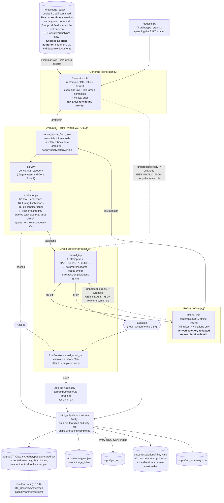

# Golden Hour — GER Casualty-Archetype Pipeline

This repo is my submission for **Assignment #6 (Generator → Evaluator → Refiner
with a Circuit Breaker)** in ELVTR's *Multi-Agent AI for Game Development*
course. It generates **casualty archetype rows** for my capstone game,
**Golden Hour**, and enforces one specific rule taken from that game's own
design documents — **`triage-system.md` § Formulas → Ground-Truth Category
Derivation**: *a row's declared SALT triage category must equal the category
derived from that row's own authored vitals.*

**Golden Hour** is a single-player VR serious game (Unreal Engine 5.8, PC
VR/OpenXR, Quest 3 via wireless streaming) that trains EMS/paramedic trainees
to triage, treat, and extract casualties from a mass-casualty incident (MCI).
Every casualty is backed by the open-source **Pulse Physiology Engine**, so a
casualty's face, breathing, and behavior are a *live clinical readout* rather
than scripted animation. Trainees run **SALT** triage and **MARCH**-ordered
interventions in a re-escalating warm zone.

## How to run

Prerequisites: [uv](https://docs.astral.sh/uv/) and (for the live run only) an
Anthropic API key. The repo commits `.python-version` (3.13), so `uv sync`
deterministically selects Python 3.13 — downloading it if needed, since the
system default here is 3.14.

Windows PowerShell:

```powershell
git clone <this-repo-url>
cd golden-hour-ger-pipeline
uv sync

# Offline — no API key needed, nothing leaves the machine:
uv run python -m pipeline --selftest     # 39 assertions: SALT truth table, rules, breaker, CSV contract
uv run python -m pipeline --offline      # full GER loop with deterministic fixtures

# Live run — needs a key:
$env:ANTHROPIC_API_KEY = "sk-ant-your-key"
uv run python -m pipeline                # generate + evaluate + refine, write output/
```

Options: `--max-attempts N` overrides the breaker's per-item refine budget;
`--out DIR` overrides the output directory.

The API key is read from the process environment only. It is never committed —
`.env` is gitignored and `.env.example` documents the two variables.

**Offline mode is a deterministic harness for CI and graders, not a second
pipeline.** Only the two LLM roles are substituted; the SALT derivation, the
evaluator, and the circuit breaker are the same production code in both modes.
The offline drafts are hand-designed to break specific rules so the whole loop
can be observed working on a machine with no credentials. Nothing in an offline
run is evidence about how a model behaves.

## Pre-Build Declaration

The declaration below was written **before** any pipeline code, and is
committed verbatim as [`PRE_BUILD_DECLARATION.txt`](PRE_BUILD_DECLARATION.txt):

> Game: Golden Hour — VR mass-casualty triage trainer (Unreal 5.8).
>
> 1. Content type: casualty archetype rows for DT_CasualtyArchetypes — the
> 23-field rows defining each casualty's injury, Pulse patient file, starting
> vitals, and assessment thresholds. The POC needs 5–15 (casualty-model.md);
> one is hand-authored today.
>
> 2. GDD rule: triage-system.md, derive_salt_category — ground-truth SALT
> category is derived from breathing, command response, peripheral pulse,
> respiratory distress (RR>30) and hemorrhage control, never author-placed.
> A row's declared category must equal the category its own vitals derive.
>
> 3. Failure: a row with RR 34, SBP 68, unresponsive, uncontrolled bleed,
> labeled Delayed/Yellow. Valid CSV, imports clean, looks plausible. In play
> the trainee correctly calls Red; scoring-and-debrief.md grades that call
> against Yellow ground truth and tells a competent trainee they
> over-triaged. The bug is invisible until debrief blames the student.

One clarification on the declaration's third point, now that
`scoring-and-debrief.md` is shipped here and can be checked. That document does
establish the consequence: it logs "triage accuracy vs. ground truth" and
scores "under-triage (<5%) and over-triage (<50%) rates", and its
Cross-References table names `triage-system.md`'s "Triage call +
ground-truth-at-tagging-time data" as the input. What it does **not** yet
contain is the arithmetic — its Formulas section is `[To be designed]`. So the
mechanism by which a wrong ground truth reaches the trainee is specified; the
exact penalty it produces is not designed yet.

## The content gap this fills

`DT_CasualtyArchetypes` is the DataTable that defines every casualty in the
scenario — which Pulse patient file it initializes from, its starting vitals,
its bleeding insult, and the per-casualty threshold bands the assessment verbs
read. It is the spine of the whole scenario's content.

**It has exactly one row today.** That row is committed in the game repo and
copied here verbatim as
[`knowledge_base/DT_CasualtyArchetypes.exemplar.csv`](knowledge_base/DT_CasualtyArchetypes.exemplar.csv)
— header plus a single casualty, `Casualty_IED_LegHemorrhage_T1`.

The target is 5–15. `casualty-model.md` states it twice:

> Baseline POC target is a hand-managed pool of ~5–15 full-fidelity casualty
> archetypes

> | Casualty pool size (POC) | 5–15 archetypes |

So the gap is real, measured, and sitting in the repo: **one row exists, five
to fifteen are needed.** The offline run below adds **6 new rows alongside**
that one — not replacing it — for a pool of 7, inside the target band.

Nothing generated here overwrites the hand-authored row. Unreal keys DataTable
rows by `Name`, so a generated row reusing an existing key silently overwrites
it on import; `run_pipeline` therefore seeds the evaluator's duplicate check
with the row names already in the live table, and the regeneration control ships
as `Casualty_IED_LegHemorrhage_T1_Gen`.

## The rule the evaluator enforces

Golden Hour never stores a triage category as data. `triage-system.md`
§ Summary:

> Every casualty carries a **ground-truth triage category** derived live from
> their Pulse physiology state — not a static, author-placed tag

The derivation is specified in **`triage-system.md` § Detailed Design → Core
Rules → rule 2**, and again in **`triage-system.md` § Formulas →
Ground-Truth Category Derivation**:

> 2. **Breathing check after airway opened**: if the casualty is not breathing
>    even after airway repositioning, category = **Dead (Black)**. Stop.
> 3. If breathing, the trainee (via examine verbs) checks four things:
>    (a) obeys commands or shows purposeful movement, (b) peripheral pulse
>    present, (c) not in respiratory distress, (d) major hemorrhage controlled.
> 4. **All four true** → check for minor-injuries-only: if yes, category =
>    **Minimal (Green)**; if no (injured but stable), category = **Delayed
>    (Yellow)**.
> 5. **Any of the four false** → apply the resource-availability check ...
>    likely to survive given currently available resources? If yes, category =
>    **Immediate (Red)**; if no, category = **Expectant (Gray)**.

Note question **(c)**. The GDD's variable table flags it explicitly:

> | respiratory_distress | ... | SALT question (c) — inverted in the formula
> (question asks "NOT in distress") |

That inversion is the single most dangerous transcription error available in
this rule — dropping it grades a tachypneic casualty as Yellow. Self-test case
3 exists solely to guard it.

Because the row has no category column, an author's belief about what a
casualty "is" lives only in their head — until it silently disagrees with the
vitals they typed. `pipeline/salt.py` transcribes the decision tree with every
branch citing its GDD line; `pipeline/evaluator.py` derives the seven SALT
inputs from each row's own numbers and compares.

One gate sits in front of all of that. `casualty-archetype-schema.md` § Group 1
defines `bApplyInitialVitalsOverride` as the switch over the five `Initial*`
fields — "when true, the five `Initial*` fields below are applied over the
patient file's own baseline at spawn; when false, the patient file's built-in
baseline stands untouched" — and defaults it to `false`. A row with the gate off
declares its own vitals inert, so deriving a category from them would be
deriving ground truth from numbers that never reach the casualty. `R1_VITALS_GATE_OFF`
catches that and the derivation is not run.

## Architecture

The same diagram source is committed standalone as
[`architecture.mmd`](architecture.mmd).



### The one design choice that makes this pipeline produce evidence

**The generator is never shown the SALT rule.** Not the decision tree, not the
derivation table, not the R1 rule text. This is stated as a comment at the top
of `pipeline/prompts.py` and it is deliberate.

On Assignment #4 of this course I gave both roles the consistency rules. The
generator self-censored, every item passed, and the graded consistency-checking
evidence came back as an empty log. Moving the rules out of the generator
prompt fixed it, and the same separation applies here — with a second reason on
top: the generator stands in for a human content author, who pictures the
injury, types plausible vitals, and declares the category their clinical
intuition suggests rather than running a decision tree field by field. The bug
this pipeline exists to catch *is generated by that intuitive process*.

The refiner is constrained the other way: it receives the violations but
**not** the derived category. The evaluator's own violation detail does name it
— a human reading the log needs to see both sides of the disagreement — so
`build_refiner_prompt` strips it via `redact_derived_category` on the way in.
If the refiner were simply told the answer, the loop would prove only that the
pipeline can copy a string, no item would ever be genuinely unfixable, and the
circuit breaker would be unreachable.

The refiner also does not receive the request brief. That boundary is what
makes the escalation below unresolvable, and it is named as a design choice in
`prompts.py` rather than left to be discovered.

## What it produces

One run writes to `output/`:

| File | Contents |
|---|---|
| `DT_CasualtyArchetypes.generated.csv` | Accepted rows only. 24 columns in `CSV_COLUMNS` order, header byte-identical to the exemplar. Directly importable into the real DataTable. |
| `archetypes.json` | Full accepted records, including the `triage_intent` the CSV cannot carry |
| `ger_log.md` | Per item, per attempt: the draft's key vitals + declared category, every violation raised (code, rule, GDD source, detail), the refiner's revision, and the final verdict |
| `escalations/<key>.md` | For each tripped item: why the breaker tripped, the full attempt history, and the decision a human has to make |
| `run_summary.json` | Counts: requested, accepted, escalated, attempts, role calls, mode, model |

All five are written from a `finally`, so a run that dies part-way through still
ships everything that completed rather than losing the whole run's work.

An escalated row is **never** written to the CSV. A row the pipeline knows is
incoherent is worse than a missing row: it imports cleanly, looks plausible,
and silently supplies the wrong ground truth to scoring.

## What the pipeline caught

Command: `uv run python -m pipeline --offline`. Result: **7 requested, 6
accepted, 1 escalated, 13 drafts evaluated, 13 role calls**
(`output/run_summary.json`). Every quote below is copied from
`output/ger_log.md` as generated.

**1. The Pre-Build Declaration's own failure, caught (`abdominal_evisceration`).**
`R1_SALT_MISMATCH`. The predicted bug was reproduced and caught on the first
evaluation. The draft declared **Yellow** with these vitals:

> RR 34 (distress threshold 30) · BP 68/44 (pulse-absent below 70) ·
> consciousness 0.15 (altered below 0.5) · hemorrhage insult 0.45

The evaluator derived **Red** and named all four failed questions:

> Found: DeclaredCategory is Yellow. The category derived from this row's own
> vitals is Red, which disagrees with the declaration. Evidence: these SALT
> questions resolved false: (a) obeys commands or shows purposeful movement;
> (b) peripheral pulse present; (c) not in respiratory distress; (d) major
> hemorrhage controlled.

This is exactly the row the declaration predicted: valid CSV, imports clean,
looks plausible, and would have told a trainee who correctly called Red that
they over-triaged. The refiner resolved it by correcting the **vitals** rather
than the declaration — the right direction here, because the brief describes a
casualty who is "awake and tracking you" with a "pulse present at the wrist"
and no active bleeding. Revised to RR 18, BP 106/66, consciousness 0.8,
hemorrhage insult 0 — which derives Yellow. Accepted after 1 refine attempt.

**2. Unlabelled invented clinical values (`ambulatory_lac_forearm`).**
`R3_MISSING_PLACEHOLDER_LABEL`. The authoring note read:

> 'Walking wounded with a superficial forearm laceration, self-controlled with
> direct pressure. Fully alert and ambulatory.'

Every vital on a generated row is invented, and `casualty-archetype-schema.md`
requires the "clinically plausible placeholder — SME validation pending" label
wherever such a value is surfaced. Without it a reader mistakes generated
numbers for SME-validated clinical data. Fixed on the first refine.

**3. A tuning knob outside its published safe range (`tension_pneumo_chest`).**
`R2_TOURNIQUET_WINDOW_BAND`:

> Found: TourniquetPassWindowSeconds is 240, outside the documented safe range
> 60–180.

Authority: `treatment-interventions.md § Tuning Knobs`. Fixed on the first
refine.

**4. An asset path that would resolve in the editor and fail in the shipped
build (`flash_burn_forearms`).** `R4_BAD_ASSET_PATH`:

> Found: CasualtyCharacterAssetPath is
> 'Content/GoldenHour/Characters/CasualtyT1/Casualty_01', which is not an
> Unreal content path (it does not start with /Game/).

`Content/...` is where the file sits on disk; `/Game/...` is how Unreal
addresses it. The two name the same asset and only the second one loads. Per
`casualty-archetype-schema.md`, this field is "a plain string nothing
type-checks, breaking silently and surfacing only in a packaged build" — the
worst possible time to find out. Fixed on the first refine.

**5. An incoherent Dead declaration (`blast_apnea_black`).**
`R1_BLACK_CONTRADICTION`:

> Found: DeclaredCategory is Black but bSurvivableWithResources = True and
> bMinorInjuriesOnly = False. The Black branch stops before either flag is
> consulted, so a true value here contradicts the declaration.

Fixed on the first refine.

**6. The circuit breaker tripped and escalated (`severe_tbi_expectant`).**
This is the one item the refiner could not resolve, and the escalation is the
correct outcome rather than a failure. The draft declared **Gray** while
authoring `bSurvivableWithResources = True`, which derives **Red**. The refiner
returned a semantically-equivalent draft, so the breaker fired on its
no-progress rule:

> **Circuit breaker tripped because**: no progress: the same rule broke on two
> consecutive attempts (R1_SALT_MISMATCH). The refiner is returning an
> equivalent draft rather than reconciling the finding

**Why it could not be fixed, precisely.** Not because the answer is unknowable —
the answer is in the request brief, which says this casualty "cannot be saved
with the resources actually available". Setting `bSurvivableWithResources` to
false makes the row derive the intended Gray and pass. The refiner never sees
that sentence: it receives the failing row and the violations and nothing else,
so the fact that decides this Immediate-versus-Expectant split is outside its
information set by construction. That is a deliberate boundary (see
`pipeline/prompts.py`), and it is what makes the circuit breaker reachable at
all.

Behind that boundary sits a second wall, which is why this is the right item to
escalate rather than a contrived one: a refiner reasoning from the knowledge
base alone would find nothing to reason *from*. `triage-system.md` § Formulas
flags `survivable_with_resources` as **[To be designed]**:

> SALT's real-world definition of this question is resource- and
> judgment-based, not threshold-based ... Do not hardcode this as always-true;
> it needs an explicit design decision before the Expectant category can be
> authored honestly.

The game has not settled its own Immediate-versus-Expectant rule, so the split
can only be settled per casualty, by a human reading the brief. The escalation
report ([`output/escalations/severe_tbi_expectant.md`](output/escalations/severe_tbi_expectant.md))
says exactly that and names the decision to make. The row was correctly kept out
of the CSV.

**7. The control passed first time (`ied_leg_hemorrhage_t1`).** The row closest
to the existing hand-authored casualty raised zero violations on its first
draft — evidence the evaluator is not simply failing everything.

That is at least one real catch from each of the four rule families (R1, R2, R3,
R4), five successful refines, and one escalation.

### Real bugs this process found in my own evaluator

**A false positive on a dead casualty's blood pressure.** The first offline run
escalated `blast_apnea_black` on `R2_BP_ORDER`. That was a bug in my rule, not a
bad row: the rule required `InitialDiastolicBP < InitialSystolicBP`, and a
casualty in cardiac arrest correctly has a blood pressure of 0/0. An over-strict
rule there would have pushed authors into inventing a blood pressure for a dead
casualty. The rule now applies only where a pulse pressure exists, while still
rejecting the genuinely impossible case (a diastolic with no systolic).
Self-test cases 6b, 6c and 6d guard both directions.

**A hole in the graded rule itself.** `derive_inputs_from_row` read the five
`Initial*` vitals without ever checking `bApplyInitialVitalsOverride`, the gate
that decides whether those vitals are applied at all — and whose documented
default is `false`. A row with the gate off had its ground-truth category
derived from numbers it declared inert, and passed every rule. `R1_VITALS_GATE_OFF`
now catches it (self-test section 11).

**Two derivations no test could see.** A mutation battery run against `salt.py`
found that inverting the peripheral-pulse comparison, and tightening the
consciousness comparison off its boundary, both survived the entire suite: no
case existed where either derivation was the only thing deciding the answer.
Self-test section 12 adds those two cases, and both mutations now fail.

Recorded here rather than quietly fixed, because "the evaluator was wrong" is a
finding worth keeping.

## Repo layout

| Path | Purpose |
|---|---|
| `knowledge_base/` | 9 files copied verbatim from the game repo so this repo is self-contained after a clean clone: 6 GDDs (`triage-system`, `casualty-model`, `patient-assessment`, `treatment-interventions`, `scenario-authoring-data`, `scoring-and-debrief`), the casualty-archetype schema decision record, the repo's DataTable-source rule (`data-files.md`), and the real one-row DataTable CSV |
| `pipeline/salt.py` | The GDD rule as pure functions. Zero LLM. Every branch cites its GDD line |
| `pipeline/evaluator.py` | R1 SALT coherence, R2 tuning-knob bands, R3 placeholder labelling, R4 schema integrity. Zero LLM |
| `pipeline/schema.py` | Pydantic models; `CSV_COLUMNS` is derived from the row model so it cannot drift from the DataTable header |
| `pipeline/requests.py` | The 7 archetype requests spanning the SALT space |
| `pipeline/prompts.py` | Generator/refiner prompt builders + the prompt-isolation rationale |
| `pipeline/generator.py` | Live Anthropic generator, JSON extraction, and the offline fixtures |
| `pipeline/refiner.py` | Live Anthropic refiner and the offline fixture |
| `pipeline/breaker.py` | Circuit breaker: per-item `should_trip` + run-level `RunBreaker` |
| `pipeline/orchestrate.py` | The GER loop and every output writer |
| `pipeline/selftest.py` | 39 offline assertions |
| `pipeline/__main__.py` | CLI (`--selftest`, `--offline`, `--max-attempts`, `--out`) + top-level error guard |

## Rubric map

| Criterion | Where it is satisfied |
|---|---|
| **Working Pipeline** | `pipeline/orchestrate.py` runs the full generate → evaluate → refine loop with the circuit breaker, and writes all five artifacts. Verified end to end: `uv run python -m pipeline --offline` processed 7 requests, accepted 6, escalated 1, evaluated 13 drafts, and the breaker tripped on the designed unfixable item. `uv run python -m pipeline --selftest` passes 39/39. The generated CSV's header is byte-identical to the real DataTable's, so the output is importable rather than merely well-formed. |
| **Evaluator Quality** | `pipeline/salt.py` + `pipeline/evaluator.py` are pure Python with zero LLM involvement — the rule is a decision tree written down in a GDD, so it is decidable and asking a model to judge it would trade a guaranteed answer for a probabilistic one. Four rule families (R1 SALT coherence with three sub-rules, R2 band conformance, R3 placeholder labelling, R4 schema integrity), and the offline run shows a real catch from every one of the four plus a breaker escalation. Every rule names its authority: a `knowledge_base/` file and section where a document publishes the rule, and an explicit "physiological invariant" or engine-behaviour label where none does — the two cases are not blurred. The one exception is `GEN_INVALID_JSON`, which is not a content rule at all but the synthetic violation a malformed role reply is converted into so the loop can retry it; it cites `pipeline/schema.py`. |
| **Game Connection** | The content type is the actual `DT_CasualtyArchetypes` DataTable, whose 24-column header the generated CSV reproduces byte-for-byte (self-test case 15 is the guard). The gap is evidenced, not asserted: one row exists in the game repo today, `casualty-model.md` specifies 5–15, and this run adds 6 more alongside it. The enforced rule is quoted from `triage-system.md`; the field semantics and the vitals-override gate come from the project's own schema decision record; the escalation report cites the game's live `[To be designed]` open question. |
| **ReadMe** | This file: the game, the zero-credential run commands up front, the verbatim pre-build declaration, the evidenced content gap, the enforced rule quoted with file and section, the architecture diagram, real quoted findings from an actual run, an honest account of three bugs the process found in my own evaluator, and an explicit verified-vs-not section. |

## What is verified vs. not

**Verified by running it, on this machine:**

- `uv sync` on pinned Python 3.13 (system default here is 3.14) — 16 packages installed.
- `uv run python -m pipeline --selftest` — **39/39 cases pass, exit code 0.**
  Includes the GDD's own worked example, the question-(c) inversion guard, the
  two mutation guards, the vitals-override gate cases, and the assertion that
  `CSV_COLUMNS` equals the exemplar CSV header exactly.
- `uv run python -m pipeline --offline` — full GER loop, exit code 0, all five
  artifact types written, circuit breaker tripped and escalated one item.
- The generated CSV header is **byte-identical** to the exemplar's (same
  SHA-256), and **every file under `output/` contains zero carriage-return
  bytes** — LF throughout, like every file this repo authors and like the
  exemplar.
- The `knowledge_base/` copies are byte-for-byte identical to their sources in
  the game repo (verified by SHA-256). Some of those sources are CRLF, so
  `.gitattributes` normalises everything in this repo to LF *except*
  `knowledge_base/`, which is exempted precisely so the copies stay byte-exact.
- **Offline determinism**: two consecutive runs produce byte-identical
  `DT_CasualtyArchetypes.generated.csv`, `archetypes.json` and
  `escalations/severe_tbi_expectant.md`. `ger_log.md` and `run_summary.json`
  differ only by the run timestamp they each record.
- Every module imports cleanly and `python -m compileall -f pipeline` is clean.
- The live path's non-network parts: the fail-fast missing-key guard, both
  prompt builders, the two knowledge-base loaders the live generator depends on
  (self-test section 14 — they are unreachable from either offline command, so
  a heading edit in the copied schema document would otherwise break only the
  live path and only on its first call), the SALT-rule leak check on the
  generator prompt, the derived-category redaction on the refiner prompt, the
  JSON extractor against fenced / prose-wrapped / brace-in-string /
  escaped-quote input and against no-JSON and truncated-JSON input, and
  schema-validation rejection.
- `architecture.mmd` renders (validated with `mmdc`), and the copy embedded
  above is identical to the file.

**Not verified here:**

- **The live Anthropic run.** There is no API key in this environment, so no
  request has ever been sent. `LiveGenerator._complete` and `LiveRefiner` are
  written, import-clean and syntax-checked, and the SDK call shape was checked
  against current `anthropic-sdk-python` documentation — but the network round
  trip, real model output, and real JSON parsing of it are untested.

  After running `uv run python -m pipeline` with a valid key, the findings to
  fill in from the real `output/ger_log.md` are: the best genuine R1 catch and
  which of the four SALT questions the model missed; how many of the seven
  passed on the first attempt with no SALT rule in their prompt (the real
  measure of whether the rule needed enforcing); one before/after refiner
  reconciliation and whether it corrected the declaration or the vitals; whether
  the breaker tripped on live output and on which policy; and any rule that
  produced a false positive, in the same spirit as the `R2_BP_ORDER` finding
  above.
- **Import into the real Unreal DataTable.** The generated CSV's header is
  byte-identical to the file that already imports, and the column order is
  derived from the row model rather than typed by hand, but no one has actually
  imported the generated file into UE 5.8 and confirmed all 24 columns map.
  The generated file also writes some whole numbers bare where the exemplar
  writes a trailing `.0` (`120` vs `120.0`); both parse identically as floats,
  but that is reasoned, not observed in the editor.
- **The clinical accuracy of the generated vitals.** Every number is a
  clinically plausible placeholder with SME validation pending — R3 exists to
  make sure the rows say so. The pipeline checks *internal coherence with the
  GDD*, which is not the same as clinical correctness, and it is not a
  substitute for the SME pass the game's own risk register already tracks.

---

Chad Josewski — ELVTR Multi-Agent AI for Game Development, Assignment #6
