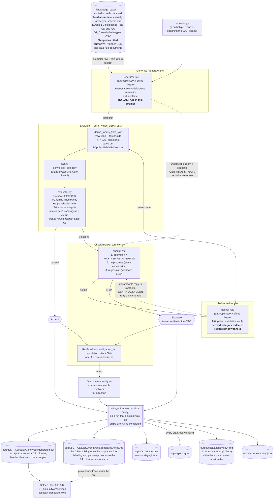

# Golden Hour — GER Casualty-Archetype Pipeline

My submission for **Assignment #6 (Generator → Evaluator → Refiner with a
Circuit Breaker)** in ELVTR's *Multi-Agent AI for Game Development* course. It
generates **casualty archetype rows** for my capstone game, **Golden Hour**, and
enforces one rule taken from that game's own design documents —
[`triage-system.md`](knowledge_base/triage-system.md) § Formulas →
Ground-Truth Category Derivation: *a row's declared SALT triage category must
equal the category derived from that row's own authored vitals.*

**Golden Hour** is a single-player VR serious game (Unreal Engine 5.8, PC
VR/OpenXR, Quest 3 via wireless streaming) training EMS/paramedic trainees to
triage, treat and extract casualties from a mass-casualty incident. Every
casualty is backed by the open-source **Pulse Physiology Engine**, so a
casualty's face, breathing and behaviour are a *live clinical readout* rather
than scripted animation.

## Rubric map

| Criterion | Where it is satisfied |
|---|---|
| **Working Pipeline** | [`orchestrate.py`](pipeline/orchestrate.py) runs the full loop with the circuit breaker and writes every artifact. `--offline`: 7 requests, 6 accepted, 1 escalated, 13 drafts, breaker tripped on the designed unfixable item. `--selftest`: 84/84, including two runs driven into a temp directory that prove an escalated row never reaches the CSV and that the run-level breaker actually stops a run. |
| **Evaluator Quality** | [`salt.py`](pipeline/salt.py) + [`evaluator.py`](pipeline/evaluator.py) are pure Python, zero LLM — the rule is a decision tree written down in a GDD, so it is decidable, and asking a model would trade a guaranteed answer for a probabilistic one. Four rule families, each with a real catch quoted under *What the pipeline caught*, plus an escalation. Every rule names its authority: a `knowledge_base/` file and section where a document publishes it, and an explicit "physiological invariant" or engine-behaviour label where none does — never blurred. The exception is `GEN_INVALID_JSON`, not a content rule but the synthetic violation a malformed role reply becomes so the loop can retry it; it cites `pipeline/schema.py`. |
| **Game Connection** | The content type is the real `DT_CasualtyArchetypes`, whose 24-column header the generated CSV reproduces byte-for-byte (self-test 15a guards it), shipped with the sibling notes file the project's own data rule requires. The gap is evidenced, the rule is quoted from `triage-system.md`, the field semantics and vitals gate come from the project's schema decision record, and the single escalation lands on the game's live `[To be designed]` open question. |
| **ReadMe** | This file: the game, zero-credential commands up front, the verbatim declaration with its provenance caveat, the three bugs this found in my own evaluator, the evidenced gap, the rule with file and section, the diagram, real quoted findings, and an explicit verified-vs-not section. |

## How to run

Prerequisites: [uv](https://docs.astral.sh/uv/), and an Anthropic API key for
the live run only. The repo commits `.python-version`, so `uv sync`
deterministically selects Python 3.13 — downloading it if needed, since the
system default here is 3.14.

Windows PowerShell:

```powershell
git clone <this-repo-url>
cd golden-hour-ger-pipeline
uv sync

# Offline — no API key needed, nothing leaves the machine. Grade these two:
uv run python -m pipeline --selftest     # 84 assertions: SALT truth table, rules, breaker, prompts, CSV contract
uv run python -m pipeline --offline      # full GER loop with deterministic fixtures

# Live run — CAUTION: this path has NEVER been executed. No API key existed in
# the build environment, so the network round trip is untested; see "What is
# verified vs. not". Grade --offline, not this.
$env:ANTHROPIC_API_KEY = "sk-ant-your-key"
uv run python -m pipeline
```

`--max-attempts N` overrides the breaker's per-item refine budget; `--out DIR`
overrides the output directory. The API key is read from the process
environment only, never committed — `.env` is gitignored and `.env.example`
documents the two variables.

**Offline mode is a deterministic harness for CI and graders, not a second
pipeline.** Only the two LLM roles are substituted; the SALT derivation, the
evaluator and the circuit breaker are the same production code in both modes.
The offline drafts are hand-designed to break specific rules so the loop can be
observed working with no credentials. Nothing in an offline run is evidence
about how a model behaves.

## Pre-Build Declaration

Committed verbatim as
[`PRE_BUILD_DECLARATION.txt`](PRE_BUILD_DECLARATION.txt). I wrote it before any
pipeline code — though this repo's history begins with a single import commit
containing the declaration and the pipeline together, so nothing here *proves*
that ordering. It is my word, and it reads as a prediction the run below either
did or did not confirm:

> Game: Golden Hour — VR mass-casualty triage trainer (Unreal 5.8).
>
> 1. Content type: casualty archetype rows for DT_CasualtyArchetypes — the
> 23-field rows defining each casualty's injury, Pulse patient file, starting
> vitals, and assessment thresholds. The POC needs 5–15 (casualty-model.md);
> one is hand-authored today.
>
> 2. GDD rule: triage-system.md, derive_salt_category — ground-truth SALT
> category is derived from breathing, command response, peripheral pulse,
> respiratory distress (RR>30) and hemorrhage control, never author-placed.
> A row's declared category must equal the category its own vitals derive.
>
> 3. Failure: a row with RR 34, SBP 68, unresponsive, uncontrolled bleed,
> labeled Delayed/Yellow. Valid CSV, imports clean, looks plausible. In play
> the trainee correctly calls Red; scoring-and-debrief.md grades that call
> against Yellow ground truth and tells a competent trainee they
> over-triaged. The bug is invisible until debrief blames the student.

One clarification on point 3, now that
[`scoring-and-debrief.md`](knowledge_base/scoring-and-debrief.md) is shipped
here and can be checked. It establishes the consequence — it logs "triage
accuracy vs. ground truth", scores "under-triage (<5%) and over-triage (<50%)
rates", and names `triage-system.md`'s ground-truth data as its input. What it
does **not** contain is the arithmetic: its Formulas section is
`[To be designed]`. The mechanism by which a wrong ground truth reaches the
trainee is specified; the exact penalty is not designed yet.

## Did it catch something I would have missed? Yes — three times, in my own evaluator

A false positive that would have corrupted the game's data, a hole in the graded
rule itself, and two derivations no test could see.

**1. A false positive on a dead casualty's blood pressure.** The first offline
run escalated `blast_apnea_black` on `R2_BP_ORDER`. That was a bug in my rule,
not a bad row: it required `InitialDiastolicBP < InitialSystolicBP`, and a
casualty in cardiac arrest correctly has a blood pressure of 0/0. Left in, it
would have pushed authors into inventing a blood pressure for a dead casualty —
the pipeline producing the kind of wrong data it exists to prevent. The rule now
applies only where a pulse pressure exists, while still rejecting the genuinely
impossible case (a diastolic with no systolic). Self-test cases 6b–6d guard both
directions.

**2. A hole in the graded rule itself.** The derivation read the five `Initial*`
vitals without checking `bApplyInitialVitalsOverride` — the gate deciding
whether those vitals apply at all, whose documented default is `false`. A row
with the gate off had its ground truth derived from numbers it declared inert,
and passed every rule. The generator prompt embeds that schema table verbatim,
so a live model is steered straight at the broken combination.
`R1_VITALS_GATE_OFF` now catches it (self-test section 11).

**3. Two derivations no test could see.** A mutation battery against
[`salt.py`](pipeline/salt.py) found that inverting the peripheral-pulse
comparison, and tightening the consciousness comparison off its boundary, both
survived the entire suite: no case existed where either derivation was the only
thing deciding the answer. Self-test section 12 adds those cases; both mutations
now fail.

Recorded rather than quietly fixed, because "the evaluator was wrong" is a
finding worth keeping.

## The content gap this fills

`DT_CasualtyArchetypes` defines every casualty in the scenario — which Pulse
patient file it initialises from, its starting vitals, its bleeding insult, and
the per-casualty threshold bands the assessment verbs read. It is the spine of
the scenario's content, and **it has exactly one row today**, copied here as
[`DT_CasualtyArchetypes.exemplar.csv`](knowledge_base/DT_CasualtyArchetypes.exemplar.csv).
[`casualty-model.md`](knowledge_base/casualty-model.md) states the target twice
("a hand-managed pool of ~5–15 full-fidelity casualty archetypes"; "Casualty
pool size (POC) | 5–15 archetypes"). So the gap is measured, not asserted: **one
row exists, five to fifteen are needed.** The offline run adds **6 rows
alongside** that one — not replacing it — for a pool of 7.

Unreal keys DataTable rows by `Name`, so a generated row reusing an existing key
silently overwrites it on import. The run therefore seeds the evaluator's
duplicate check from the live table, and the regeneration control ships as
`Casualty_IED_LegHemorrhage_T1_Gen`.

## The rule the evaluator enforces

Golden Hour never stores a triage category as data.
[`triage-system.md`](knowledge_base/triage-system.md) § Summary: "Every casualty
carries a **ground-truth triage category** derived live from their Pulse
physiology state — not a static, author-placed tag". The derivation is in
§ Detailed Design → Core Rules → rule 2, and again in § Formulas:

> 2. **Breathing check after airway opened**: if the casualty is not breathing
>    even after airway repositioning, category = **Dead (Black)**. Stop.
> 3. If breathing, the trainee (via examine verbs) checks four things:
>    (a) obeys commands or shows purposeful movement, (b) peripheral pulse
>    present, (c) not in respiratory distress, (d) major hemorrhage controlled.
> 4. **All four true** → check for minor-injuries-only: if yes, category =
>    **Minimal (Green)**; if no (injured but stable), category = **Delayed
>    (Yellow)**.
> 5. **Any of the four false** → apply the resource-availability check ...
>    likely to survive given currently available resources? If yes, category =
>    **Immediate (Red)**; if no, category = **Expectant (Gray)**.

Note question **(c)**. The GDD's variable table flags `respiratory_distress` as
"SALT question (c) — inverted in the formula (question asks 'NOT in distress')".
That inversion is the most dangerous transcription error available here —
dropping it grades a tachypneic casualty as Yellow. Self-test case 3 guards it.

Because the row has no category column, an author's belief about what a casualty
"is" lives only in their head — until it silently disagrees with the vitals they
typed. [`salt.py`](pipeline/salt.py) transcribes the decision tree with every
branch citing its GDD line; [`evaluator.py`](pipeline/evaluator.py) derives the
seven SALT inputs from each row's own numbers and compares.

Consciousness is not a column either, and that one is worth stating outright
because it is the *sole* input to question (a).
[`casualty-archetype-schema.md`](knowledge_base/casualty-archetype-schema.md)
§ Group 1 leaves it off the row on purpose — consciousness is a physiology
**output** of the Pulse pipeline, and "carrying them here would misrepresent
them as authored config when they are computed state". So it travels as
authoring intent beside the declared category, never as shipped data, and the
generated notes file lists it as one of the five deliberate non-columns the file
enumerates — each with its own documented reason — rather than leaving a reader
to assume any of them was forgotten. That count is derived from the model rather
than typed into the prose, and self-test cases 22e/22f fail if the file's stated
number stops matching the fields it describes.

One gate sits in front of all of it.
[`casualty-archetype-schema.md`](knowledge_base/casualty-archetype-schema.md)
§ Group 1 makes `bApplyInitialVitalsOverride` the switch over the five
`Initial*` fields — "when true, the five `Initial*` fields below are applied
over the patient file's own baseline at spawn; when false, the patient file's
built-in baseline stands untouched" — and defaults it to `false`. A row with the
gate off declares its own vitals inert, so `R1_VITALS_GATE_OFF` fires and the
derivation is not run.

## Architecture

Committed standalone as [`architecture.mmd`](architecture.mmd); self-test case
15b asserts this embedded copy is identical to it.



### The one design choice that makes this pipeline produce evidence

**The generator is never shown the SALT rule** — not the decision tree, not the
derivation table, not the R1 rule text. Assignment #4 of this course taught me
this the hard way: I gave both roles the consistency rules, the generator
self-censored, every item passed, and the graded evidence came back as an empty
log. A second reason sits on top of that one: the generator stands in for a
human content author, who pictures the injury, types plausible vitals and
declares the category their intuition suggests rather than running a decision
tree field by field — and the bug this pipeline catches *is generated by that
intuitive process*.

The refiner is constrained the other way: it gets the violations but **not** the
derived category, which the evaluator's own detail does name for the human
reading the log. Told the answer, the loop would prove only that the pipeline
can copy a string, no item would ever be genuinely unfixable, and the breaker
would be unreachable. The refiner also never receives the request brief — the
boundary that makes the escalation below unresolvable.

Both constraints are written down as rationale in
[`prompts.py`](pipeline/prompts.py), and both are now *enforced* rather than
merely explained. Self-test **24** builds the generator prompt for all seven
requests and fails if any of them carries a fingerprint of the decision tree,
the derivation table or the R1 rule; self-test **4d** builds the refiner prompt
from a real failing item and fails if the derived category survives into it.
Before 24 existed, the claim in bold above was a comment and my word: one added
citation in the schema excerpt the prompt slices, or one helpful edit to a
brief, would have quietly reproduced the Assignment #4 outcome — and it would
have announced itself as every item passing first time, which reads like
success.

## What it produces

| File | Contents |
|---|---|
| [`DT_CasualtyArchetypes.generated.csv`](output/DT_CasualtyArchetypes.generated.csv) | Accepted rows only, header byte-identical to the exemplar, directly importable. Its 24 columns are the row struct's 23 authored fields plus the `Name` key column Unreal supplies for every DataTable — which is why the declaration says 23 and this says 24 |
| [`DT_CasualtyArchetypes.generated.notes.md`](output/DT_CasualtyArchetypes.generated.notes.md) | The CSV's sibling notes file: per-row placeholder labelling, declared vs derived category, and what the run refused to ship. Required by [`data-files.md`](knowledge_base/data-files.md) § Carve-out — Unreal's CSV importer has no comment syntax, so provenance goes in a sibling `<Name>.notes.md`, never inline |
| [`archetypes.json`](output/archetypes.json) | Full accepted records, including the `triage_intent` the CSV cannot carry |
| [`ger_log.md`](output/ger_log.md) | Per item, per attempt: the draft, every violation with its authority, **what each refine actually changed**, the verdict |
| [`escalations/<key>.md`](output/escalations/severe_tbi_expectant.md) | Per tripped item: the trip reason, the attempt history, the decision a human has to make |
| [`run_summary.json`](output/run_summary.json) | Counts: requested, accepted, escalated, attempts, role calls, mode, model |

All are written from a `finally`, so a run that dies part-way still ships
everything that completed. An escalated row is **never** written to the CSV: a
row the pipeline knows is incoherent is worse than a missing row, because it
imports cleanly, looks plausible, and silently supplies the wrong ground truth
to scoring. Self-test section 22 drives that end to end and reads the CSV back
to prove it.

## What the pipeline caught

`uv run python -m pipeline --offline` → **7 requested, 6 accepted, 1 escalated,
13 drafts evaluated, 13 role calls** ([`run_summary.json`](output/run_summary.json)).
Quotes below are copied from [`ger_log.md`](output/ger_log.md) as generated.

**The headline is in the data:** the seven requests span all five SALT
categories; one generates cleanly and five are repaired on a single refine; the
one that escalates is the Gray/Expectant casualty — precisely the category
`triage-system.md` § Formulas still flags `[To be designed]`, with no resource
model behind it. **The pipeline's only failure is the game's own open
question.**

**1. The Pre-Build Declaration's own failure, caught (`abdominal_evisceration`).**
`R1_SALT_MISMATCH` on the first evaluation. The draft declared **Yellow** with
RR 34 (distress threshold 30), BP 68/44 (pulse-absent below 70), consciousness
0.15 (altered below 0.5), hemorrhage insult 0.45. The evaluator derived **Red**:

> Found: DeclaredCategory is Yellow. The category derived from this row's own
> vitals is Red, which disagrees with the declaration. Evidence: these SALT
> questions resolved false: (a) obeys commands or shows purposeful movement;
> (b) peripheral pulse present; (c) not in respiratory distress; (d) major
> hemorrhage controlled.

Exactly the row the declaration predicted: valid CSV, imports clean, looks
plausible, and would have told a trainee who correctly called Red that they
over-triaged. The refiner corrected the **vitals** rather than the declaration —
right here, because the brief describes a casualty "awake and tracking you",
whose "pulse is present at the wrist", carrying a wound that "is not actively
pouring blood right now". The log records what changed
(`InitialRespirationRateBpm 34 → 18; InitialSystolicBP 68 → 106;
HemorrhageInsultMagnitude01 0.45 → 0; InitialConsciousness01 0.15 → 0.8`, among
others). Accepted after one refine.

**2. Unlabelled invented clinical values (`ambulatory_lac_forearm`).**
`R3_MISSING_PLACEHOLDER_LABEL`. Every vital on a generated row is invented, and
`casualty-archetype-schema.md` requires the "clinically plausible placeholder —
SME validation pending" label wherever such a value is surfaced; without it a
reader mistakes generated numbers for validated clinical data.

**3. A tuning knob outside its published safe range (`tension_pneumo_chest`).**
`R2_TOURNIQUET_WINDOW_BAND` — "TourniquetPassWindowSeconds is 240, outside the
documented safe range 60–180", per
[`treatment-interventions.md`](knowledge_base/treatment-interventions.md)
§ Tuning Knobs. The log shows the repair as `240 → 120`.

**4. An asset path that resolves in the editor and fails in the shipped build
(`flash_burn_forearms`).** `R4_BAD_ASSET_PATH`: written as
`Content/GoldenHour/...`, where the file sits on disk, rather than
`/Game/GoldenHour/...`, which is how Unreal addresses it. Same asset, and only
the second one loads. Per `casualty-archetype-schema.md` this field is "a plain
string nothing type-checks, breaking silently and surfacing only in a packaged
build" — the worst possible time to find out.

**5. An incoherent Dead declaration (`blast_apnea_black`).**
`R1_BLACK_CONTRADICTION`: declared Black while authoring
`bSurvivableWithResources = True`. The Black branch stops before that flag is
consulted, so a true value contradicts the declaration.

Findings 2 to 5 were each fixed on the first refine.

**6. The circuit breaker tripped and escalated (`severe_tbi_expectant`).** The
one item the refiner could not resolve — and escalation is the correct outcome,
not a failure. The draft declared **Gray** while authoring
`bSurvivableWithResources = True`, which derives **Red**. The refiner returned a
semantically-equivalent draft (the log's change line shows the only difference:
the authoring note gained a sentence), so the breaker fired on no-progress.

Not because the answer is unknowable. It is in the request brief — this casualty
"cannot be saved with the resources actually available", so setting
`bSurvivableWithResources` to false derives the intended Gray and passes. The
refiner never sees that sentence: it gets the failing row and the violations,
nothing else, so the fact deciding this Immediate-versus-Expectant split is
outside its information set by construction. Behind that boundary is a second
wall, which is why this is the right item to escalate rather than a contrived
one: a refiner reasoning from the knowledge base alone would find nothing to
reason *from*. `triage-system.md` § Formulas flags `survivable_with_resources`
**[To be designed]** — "Do not hardcode this as always-true; it needs an
explicit design decision before the Expectant category can be authored
honestly." The [escalation report](output/escalations/severe_tbi_expectant.md)
says exactly that and names the decision to make. The row was kept out of the
CSV.

**7. The control passed first time (`ied_leg_hemorrhage_t1`).** The row closest
to the existing hand-authored casualty raised zero violations on its first draft
— evidence the evaluator is not simply failing everything.

That is at least one real catch from each of the four rule families, five
successful refines, and one escalation.

## Repo layout

| Path | Purpose |
|---|---|
| [`knowledge_base/`](knowledge_base) | 9 files copied verbatim from the game repo so this repo is self-contained after a clean clone: 6 GDDs, the schema decision record, the DataTable-source rule, and the real one-row CSV. Two are read at runtime; the rest are shipped as cited authority |
| [`salt.py`](pipeline/salt.py) | The GDD rule as pure functions. Zero LLM. Every branch cites its GDD line |
| [`evaluator.py`](pipeline/evaluator.py) | R1–R4. Zero LLM |
| [`schema.py`](pipeline/schema.py) | Pydantic models; `CSV_COLUMNS` derived from the row model so it cannot drift from the header |
| [`requests.py`](pipeline/requests.py) | The 7 archetype requests spanning the SALT space |
| [`prompts.py`](pipeline/prompts.py) | Prompt builders + the prompt-isolation rationale |
| [`generator.py`](pipeline/generator.py) | Live generator, JSON extraction, offline fixtures |
| [`refiner.py`](pipeline/refiner.py) | Live refiner and the offline fixture |
| [`breaker.py`](pipeline/breaker.py) | Per-item `should_trip` + run-level `RunBreaker` |
| [`orchestrate.py`](pipeline/orchestrate.py) | The GER loop and every output writer |
| [`selftest.py`](pipeline/selftest.py) | 84 offline assertions |
| [`__main__.py`](pipeline/__main__.py) | CLI + top-level error guard |

## What is verified vs. not

**Verified by running it, on this machine:**

- `uv sync` on pinned Python 3.13 (system default here is 3.14) — 16 packages.
- `--selftest`: **84/84 pass, exit 0** — including the GDD's worked example, the
  question-(c) inversion guard, the two mutation guards, the vitals gate, the
  JSON extractor against fenced / prose-wrapped / brace-in-string /
  escaped-quote / no-JSON / truncated input, and the two end-to-end runs above.
- `--offline`: full loop, exit 0, every artifact written, breaker tripped and
  escalated one item.
- The generated CSV header is byte-identical to the exemplar's (SHA-256), and
  every file under `output/` contains zero carriage-return bytes. The
  `knowledge_base/` copies are byte-for-byte identical to their game-repo
  sources (SHA-256); some of those sources are CRLF, so `.gitattributes`
  normalises this repo to LF *except* `knowledge_base/`, exempted precisely so
  the copies stay byte-exact.
- **Determinism**: two consecutive offline runs produce byte-identical
  `DT_CasualtyArchetypes.generated.csv`, `archetypes.json` and
  `escalations/severe_tbi_expectant.md`. `ger_log.md`, the notes file and
  `run_summary.json` differ only by the timestamp each records.
- Every module imports cleanly; `python -m compileall -f pipeline` is clean.
- **Self-test 24 was mutation-tested rather than assumed.** On a scratch copy I
  cited the SALT rule inside the schema excerpt the prompt slices, and
  separately leaked a rule variable into one request brief: 24a failed both
  times, and emptying the prompt failed 24b instead. That exercise also found
  something real — the failure *message* named the leak with an arrow, this
  console is cp1252, and printing it raised a codec error that killed the run
  before it could print the finding or the summary. A failing check that cannot
  say why is worth nothing, so stdout and stderr now substitute unencodable
  characters instead of raising; self-test 19d holds that.
- The live path's non-network parts. **Both prompt builders are built and
  inspected by name, not merely imported.** Self-test **24** builds the
  generator prompt for all seven requests and asserts none of them contains a
  fingerprint of the SALT decision tree, the derivation table or the R1 rule —
  the guard on the design claim above, which until now was only a comment in
  `prompts.py`; **24b** asserts each prompt still carries its brief and the
  field spec, so 24a cannot be satisfied by an empty prompt. Self-test **4d**
  builds the refiner prompt from a real failing item and asserts none of the
  five derived-category disclosure sentences survives into it. Also covered:
  the fail-fast missing-key guard, schema rejection, and the two knowledge-base
  loaders only the live generator uses (self-test 14 — unreachable from either
  offline command, so a heading edit in the copied schema document would
  otherwise break the live path alone, on its first call).
- `architecture.mmd` renders (validated with `mmdc`); self-test 15b asserts the
  embedded copy matches it.

**Not verified here:**

- **The live Anthropic run.** No API key exists in this environment, so no
  request has ever been sent. `LiveGenerator` and `LiveRefiner` are written,
  import-clean and syntax-checked, and the SDK call shape was checked against
  current `anthropic-sdk-python` documentation — but the network round trip,
  real model output and real parsing of it are untested. What a real run would
  add, from `ger_log.md`: the best genuine R1 catch; how many of the seven
  passed first time with no SALT rule in their prompt (the real measure of
  whether the rule needed enforcing); whether a refine corrected the declaration
  or the vitals; whether the breaker tripped, and on which policy; and any false
  positive, in the spirit of `R2_BP_ORDER` above.
- **Import into the real Unreal DataTable.** The header is byte-identical to the
  file that already imports and the column order is derived from the row model,
  but nobody has imported the generated file into UE 5.8 and confirmed all 24
  columns map. It also writes some whole numbers bare where the exemplar writes
  a trailing `.0` (`120` vs `120.0`); both parse identically as floats, but that
  is reasoned, not observed in the editor.
- **The clinical accuracy of the generated vitals.** Every number is a
  clinically plausible placeholder with SME validation pending — R3 makes the
  rows say so and the notes file carries that into the artifact. The pipeline
  checks *internal coherence with the GDD*, which is not clinical correctness,
  and is no substitute for the SME pass the game's risk register already tracks.
- **R3 checks provenance, not wording.** It requires both "placeholder" and
  "SME validation pending", case- and whitespace-insensitively — not the literal
  label — so a note carrying both phrases in mangled prose passes. Matching the
  exact string would fail an honest note over an em dash an editor rewrote,
  which is the worse error of the two.

---

Chad Josewski — ELVTR Multi-Agent AI for Game Development, Assignment #6
